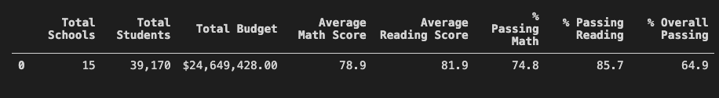
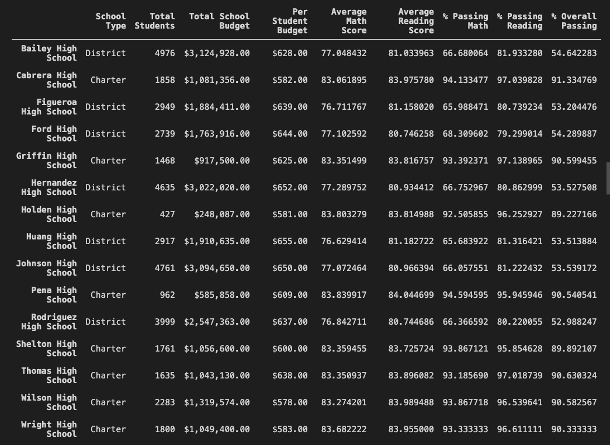
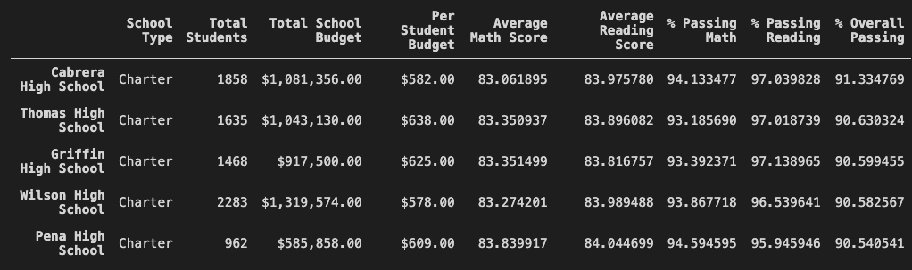
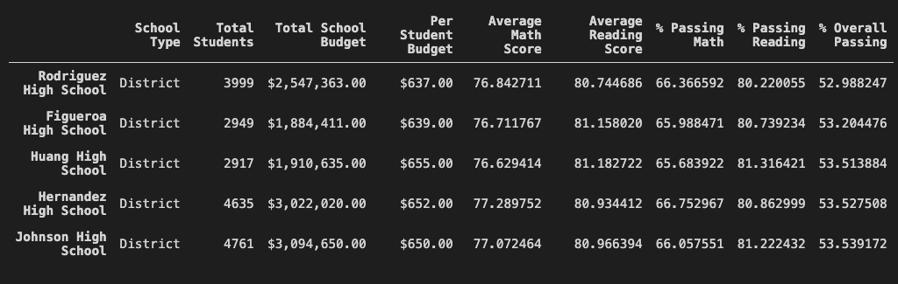
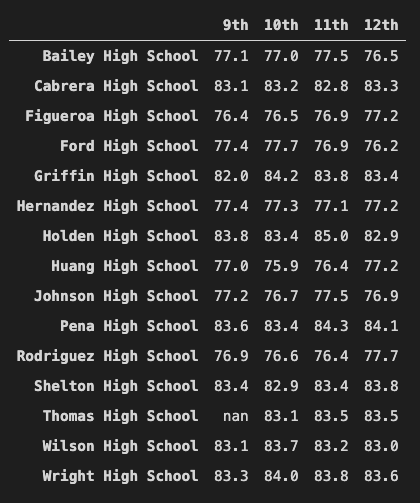
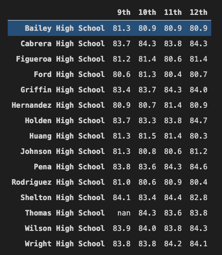
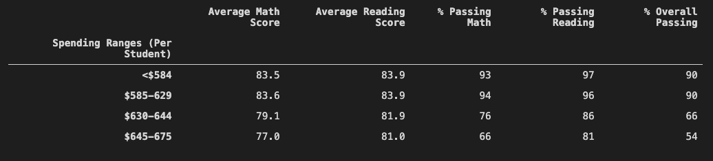
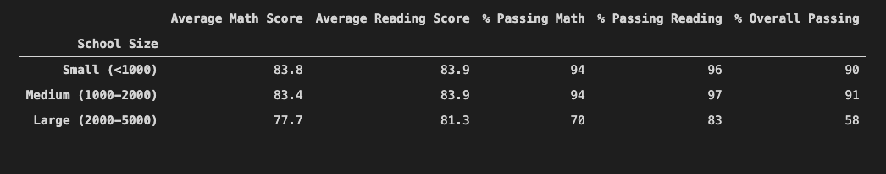
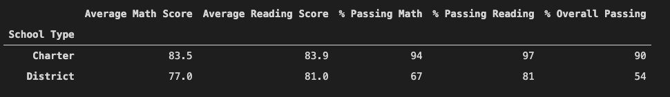

# School District Analysis
## Overview
The purpose of this project is to provide Maria, our client, a detailed analysis of her school district. While preforming the analysis, we were notified that there was grade tampering with the Thomas High School 9th grade reading and math scores. These values were replaced with NaN. The analysis was then preformed excluding the above mentioned values. The analysis includes:
- A high-level snapshot of the district's key metrics, presented in a table format
- An overview of the key metrics for each school, presented in a table format
- Tables presenting each of the following metrics:
  - Top 5 and bottom 5 performing schools, based on the overall passing rate
  - The average math score received by students in each grade level at each school
  - The average reading score received by students in each grade level at each school
  - School performance based on the budget per student
  - School performance based on the school size 
  - School performance based on the type of school

## Results
- <b>Key metrics for the district
  
- Key metrics for each school
  
- Top 5 performing schools, based on the overall passing rate
  
- Bottom 5 performing schools, based on the overall passing rate
  
- The average math score received by students in each grade level at each school
  
- The average reading score received by students in each grade level at each school
  
- School performance based on the budget per student
  
- School performance based on the school size 
  
- School performance based on the type of school
  

- How is the district summary affected?</b> 
  The district summary is affected very slightly. Since the averages for math and reading, as well as the percentages of students passing math, reading, and overall are for the district as a whole, the changes to one grade impacted the results very little. The changes were around a 0.1-0.2 drop in averages and percentages across math, reading and overall.
- <b>How is the school summary affected?</b> 
  The school summary as a whole is unaffected, outside of Thomas High School.
- <b>How does replacing the ninth graders’ math and reading
  scores affect Thomas High School’s performance relative to
  the other schools?</b> 
  Thomas High School is unaffected compared to the other schools. Thomas High School ranked 2nd in overall passing percentages, before and after altering the 9th grade grades.
- <b>How does replacing the ninth-grade scores affect the
  following:</b> 
  - <b>Math and reading scores by grade</b> 
    The math and reading grades for 9th grade were replaced with NaN. 10th, 11th, and 12th were unaffected.
  - <b>Scores by school spending</b> 
    There was a slight increase in averages and percents across the board in the $585-629 range, and a slight decrease in averages and percents across the board in the $630-675 range.
  - <b>Scores by school size</b> 
    No noticable change after formatting.
  - <b>Scores by school type</b> 
     No noticable change after formatting.
## Summary
<b>Major changes after reading and math scores for Thomas High School were replaced with NaN.</b> 
  1. There were no 9th grade average math or reading scores for Thomas High school.
  2. The overall district averages were slightly lowered
  3. Thomas High School math and reading averages and percentages slightly lowered.
  4. Silght decrease in averages and percents in the $630-675 range of school budget per student.